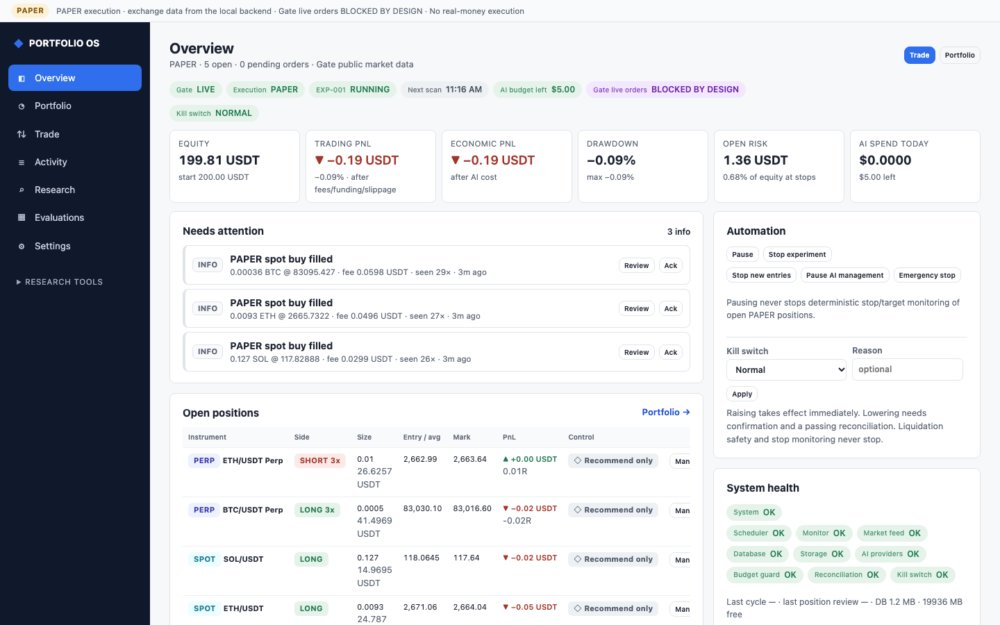
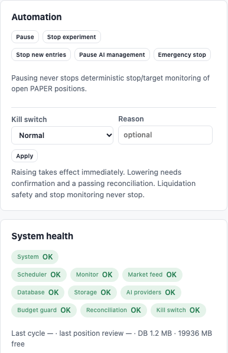
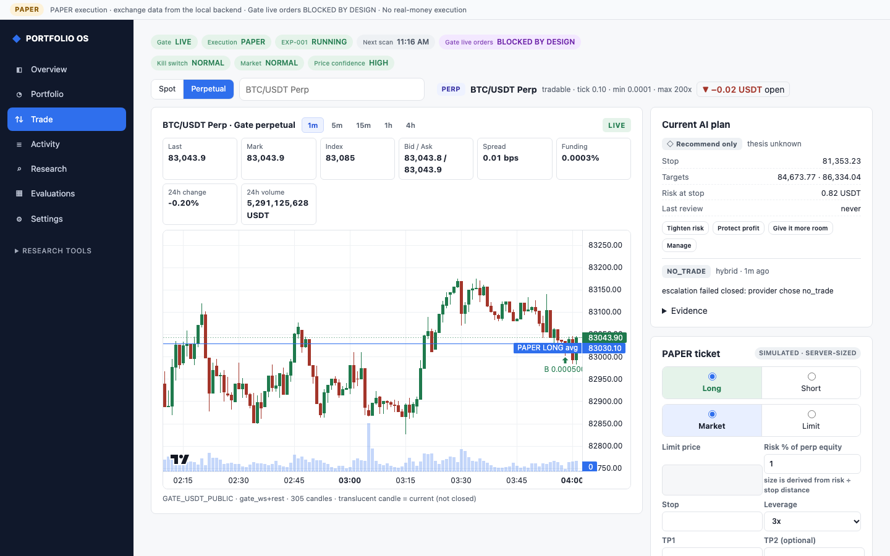
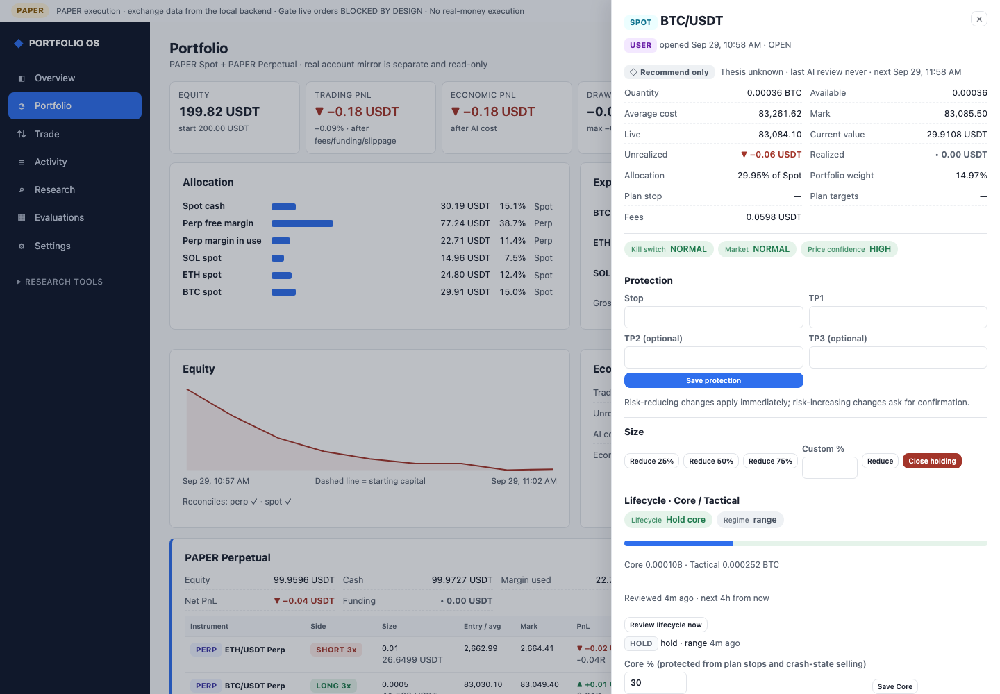
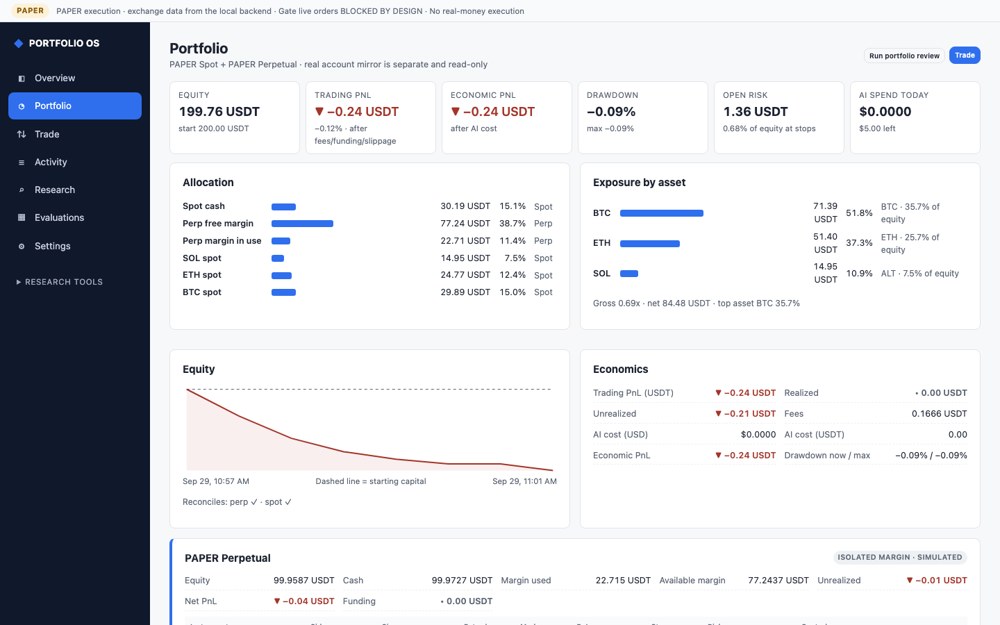
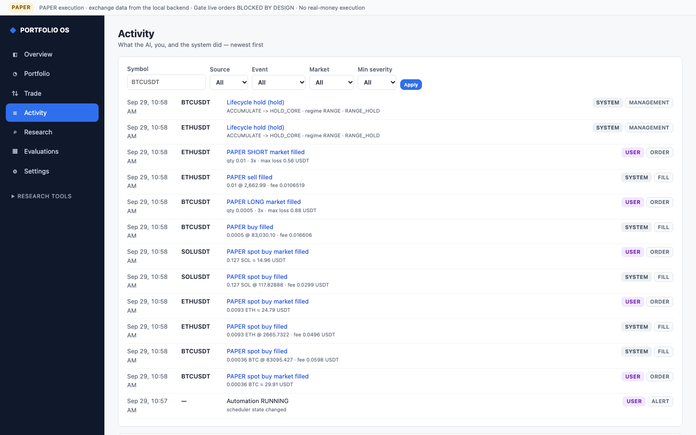
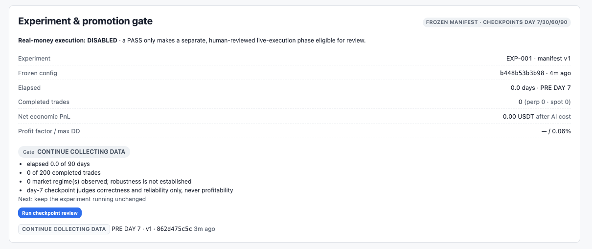
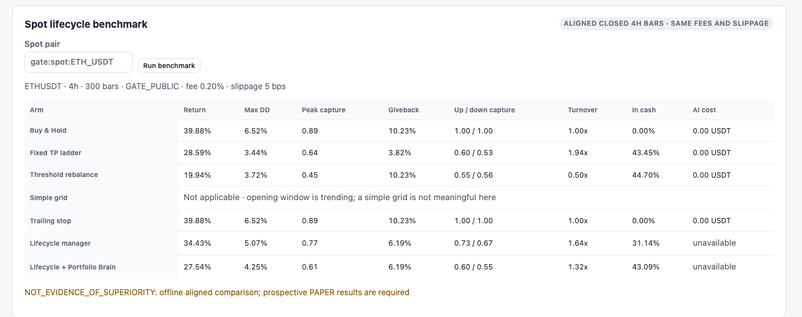
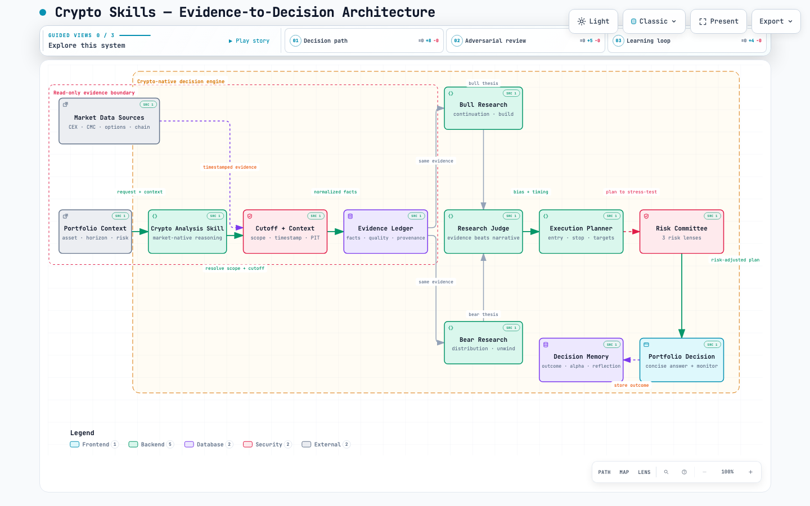

# Crypto Skills

ภาษา: English · [ไทย](README.th.md)

**An evidence-first crypto analysis skill plus a local AI Portfolio Trading OS that runs in PAPER mode only.**

    



The repository has two parts:

1. **`crypto-market-trading-analysis`**: a Codex / Claude / Gemini skill for evidence-based market analysis, execution planning, and risk-aware decisions.
2. **A local PAPER trading lab**: a Spot + Perpetual portfolio cockpit that runs on real Gate public market data. It uses typed Jev decisions, optional GPT-6 Luna escalation, deterministic risk and execution safety, long-cycle Spot management, crash-safe recovery, and experiment promotion gates.

> [!IMPORTANT]
> **No real money moves.** Every fill is simulated. Gate order, amend, cancel, leverage, transfer, and withdrawal paths are blocked by design. Servers bind to loopback only, and credentials never reach SQLite, prompts, logs, API responses, or exports.

## Quick start

```bash
git clone https://github.com/myh-st/crypto-skills.git && cd crypto-skills
python3 -m crypto_eval paper-server            # http://127.0.0.1:8765/  (fixture data on first run)
```

That's it. There is nothing to install: Python uses only the standard library and the frontend has no build step.

- **Real market data:** switch the experiment to `gate_usdt` in *Research › Paper Trading Lab*. It uses public, unauthenticated Gate endpoints.
- **Real AI (optional):** put the credentials in `.env`, then run `python3 -m crypto_eval paper-setup-real`. This moves them into the OS credential store and configures Jev and Azure AI Foundry. Then test each provider in Settings.

## What you can do

| | |
|---|---|
| **Automation, kill switch, and system health.** Pause or stop automation. Raise the kill switch instantly; lowering it needs confirmation and a passing reconciliation. Health covers the scheduler, monitor, feed, database, storage, AI providers, budget, and reconciliation. |  |
| **Trade.** A live Gate chart (1m to 4h) with PAPER entries and exits, quote, spread, and funding. A server-sized ticket (Perp quantity is derived from risk and stop, never typed), plus the current AI plan with one-click re-plan intents. |  |
| **Position manager.** Protection edits, reduce/close, and authority (`AUTO_PAPER`, `RECOMMEND_ONLY`, `MANUAL_OVERRIDE`, `PAUSED`). Live safety status, the Spot lifecycle state, and the Core/Tactical split. |  |
| **Portfolio.** Spot and Perpetual in one allocation view, with exposure by asset, an equity curve, economics, orders, and a read-only mirror of the real account kept separate. |  |
| **Activity.** One journal of what the AI, you, and the system did: orders, fills, lifecycle reviews, safety events, and alerts. |  |
| **Promotion gate.** A frozen experiment manifest, reproducible day 7/30/60/90 checkpoints, and a deterministic verdict. A PASS never enables real-money execution. |  |
| **Spot lifecycle benchmark.** Lifecycle management vs Buy & Hold, TP ladder, rebalance, grid, and trailing stop on the same bars, fees, and slippage. |  |

## Capabilities

| Area | What it does | Details |
|---|---|---|
| **Portfolio OS** | Gate Spot + Perp catalog; Spot accounting (average cost, fees, partial limit fills); unified orders with idempotent `client_request_id`; authority modes; structured AI re-plan with before/after diff; Portfolio Brain that can only shrink or block; attention queue; post-trade learning; strategy tournament with AI cost | [ai-portfolio-trading-os.md](docs/ai-portfolio-trading-os.md) |
| **AI decision stack** | Closed 15m candle → deterministic features and quant gate → Jev typed decision → versioned escalation → optional GPT-6 Luna plus this skill → validated intent. AI never sets size or leverage and cannot override risk. Budget guard with a versioned price book; paid calls fail closed | [paper-futures-runtime.md](docs/paper-futures-runtime.md) |
| **Trend sleeves engine** | EXP-002 (`sleeves_v1`): three long/short futures strategies, each in its own PAPER sub-account. They are a Donchian 4h breakout with a trailing stop, 60-day time-series momentum, and weekly cross-sectional momentum, on BTC, ETH, NEAR, SEI, SUI, AVAX and ENA. The capital split is rebalanced monthly. A 4-year replay through the real runtime reached Sharpe 1.32 (+37% a year) with an 18.5% max drawdown, and Sharpe 1.18 at double costs | [trend-sleeves-engine.md](docs/trend-sleeves-engine.md) |
| **Execution safety** | Market states (`NORMAL`, `VOLATILITY_ALERT`, `CRASH_MODE`, `RECOVERY`, `MARKET_DATA_UNTRUSTED`); suspect-print filter; execution planner (slippage envelope, slicing, TTL, sell velocity); 5-level kill switch; ledger reconciliation; liquidation-emergency reduce; duplicate, stale, and wrong-side guards | [crash-execution-safety.md](docs/crash-execution-safety.md) |
| **Spot lifecycle** | Typed long-cycle states (accumulate → hold Core → trend expansion → protect → distribute → reduce → exit → cash wait); point-in-time regime evidence; progressive distribution; Core sold only on a confirmed breakdown; aligned benchmark arms | [spot-cycle-lifecycle-manager.md](docs/spot-cycle-lifecycle-manager.md) |
| **Resilience** | Startup recovery before automation; persisted scheduler slots (missed periods are explicit, never back-filled); incidents and health; provider circuit breaker; verified, secret-free backup/restore; single-instance lock; graceful SIGTERM; accelerated soak | [continuous-paper-resilience.md](docs/continuous-paper-resilience.md) |
| **Promotion gates** | Frozen experiment manifest (a material change creates a new version; drift invalidates reviews); checkpoint reports with denominators; verdict `PASS` / `CONTINUE_COLLECTING_DATA` / `FAIL_*` / `INVALID_EXPERIMENT` | [experiment-promotion-gates.md](docs/experiment-promotion-gates.md) |
| **Analysis skill** | Evidence ledger → Bull vs Bear → judge → execution plan → risk lenses → decision. Point-in-time safe; concise, decision-first answers | [SKILL.md](skills/crypto-market-trading-analysis/SKILL.md) |

## How a PAPER decision flows

```text
Gate public data (REST + WebSocket)  ─►  closed 15m candle + 1h/4h context
        │
        ▼
features + quant gate ─► Jev typed decision ─► escalation policy ─► (optional) GPT-6 Luna + skill
        │                                                                   │
        └──────────────────────────► validated TradingIntent ◄──────────────┘
                                          │
          RiskEngine sizing ─► Portfolio Brain (shrink/block) ─► crash & execution safety
                                          │
                     PAPER fills · funding · liquidation · Spot accounting
                                          │
        SQLite ledger ─► reconciliation ─► activity / attention ─► checkpoint & promotion gate
```

Authority order: **liquidation/accounting > risk engine > crash/price/liquidity guards > Portfolio Brain > AI/human.** A lower layer can shrink, defer, or block; it can never expand what a higher layer allows.

## Project status

| Phase | Scope | State |
|---|---|---|
| 1 | AI Portfolio Trading OS | ✅ merged |
| 2 | Crash, price, liquidity, and execution safety | ✅ merged |
| 3 | Spot Cycle Lifecycle Manager | ✅ merged |
| 4 | Continuous PAPER resilience | ✅ merged |
| 5 | Experiment promotion gates | ✅ merged |
| 6 | Live execution gateway | ⛔ planning only, live disabled |

**Strategy engines:** EXP-001 runs the 15m breakout with AI routing. EXP-002 runs the [trend sleeves engine](docs/trend-sleeves-engine.md). Both are PAPER only.

**Feature development is frozen. The PAPER campaign is next:** 500 USDT of PAPER capital, checkpoints at day 7/30/60/90, and a target of 200–300 completed trades. See the [campaign runbook](docs/paper-500-campaign-runbook.md) and the [development train](docs/development-train.md).

## Command cheat sheet

```bash
python3 -m crypto_eval paper-server [--database P] [--no-live-stream]   # the app (loopback only)
python3 -m crypto_eval paper-setup-real                                  # .env creds → OS credential store
python3 -m crypto_eval paper-checkpoint [--database P] [--dry-run]       # checkpoint report + promotion gate
python3 -m crypto_eval paper-backup [--database P]                       # verified, secret-free snapshot
python3 -m crypto_eval paper-restore BACKUP [--database P] [--force]     # restore (server stopped)
python3 -m crypto_eval paper-soak --database FRESH.sqlite3 --days 3      # accelerated restart/sleep soak
python3 -m crypto_eval portfolio-real-check [--full-loop]                # REAL local acceptance (paid AI calls)
python3 -m crypto_eval demo --out-dir reports/crypto-eval-demo           # offline evaluation-harness demo
```

## Tests

```bash
python3 scripts/validate_repo.py                  # schemas, examples, enums, skill structure
python3 -m unittest discover -s tests -v          # 300+ deterministic tests (fixtures/fakes only)
node --test frontend/tests/*.test.mjs             # frontend rendering tests
find frontend -name '*.js' -exec node --check {} \;
```

CI (`.github/workflows/validate.yml`) runs all of the above plus the demo on every PR. CI never makes network or paid calls. Real Gate data and real Jev/Luna are exercised only by explicit local acceptance commands.

---

## The analysis skill

### Install

```bash
mkdir -p ~/.codex/skills
ln -sfn "$PWD/skills/crypto-market-trading-analysis" ~/.codex/skills/crypto-market-trading-analysis
```

For Claude Code use `~/.claude/skills/`; for Gemini CLI use `gemini skills link <path>`. The repository contains no credentials; connect market-data sources through your runtime environment.

<details>
<summary><b>One-shot setup prompt</b> (Codex, Claude Code, Gemini CLI, or another agent): detects the host, installs safely, validates, and reports</summary>

```text
You are installing the Crypto Skills repository as a reusable crypto-market analysis skill.

Source of truth:
  https://github.com/myh-st/crypto-skills.git
Skill directory inside the repository:
  skills/crypto-market-trading-analysis

Goal:
  Detect the current AI client (Codex, Claude Code, Gemini CLI, or another agent),
  install or update this skill at the safest supported scope, validate it, and give
  me a concise completion report. Prefer the current workspace for project-local
  setup. Use a user/global scope only when I explicitly ask for it or when this
  client has no workspace skill directory.

Safety rules:
1. Inspect the OS, current working directory, client/version, and repository state
   before changing files. Do not use `git reset --hard`, broad recursive deletes,
   or commands that overwrite unrelated files.
2. If the repository is not present, clone it to a clearly reported directory. If
   it already exists, fetch/update only when it is the same repository and preserve
   uncommitted work. Record the installed commit SHA.
3. The source skill must contain `SKILL.md`; use the whole skill directory so its
   `references/`, `examples/`, and optional `agents/` metadata remain available.
4. If the destination already exists, compare it with the source. Prefer a symlink
   for a local checkout or a copy for a portable install. Before replacing an
   unrelated destination, move that exact directory to a timestamped backup and
   show the backup path. Ask me first if the replacement would be destructive or
   needs elevated permissions.
5. Run the repository validator: `python3 scripts/validate_repo.py`. Also verify
   that `SKILL.md` starts with valid YAML frontmatter and that
   `agents/openai.yaml` is present when installing for Codex. If the Codex
   validator exists, run `uv run --with pyyaml python ~/.codex/skills/.system/skill-creator/scripts/quick_validate.py skills/crypto-market-trading-analysis` without installing global packages.

Use the native integration that matches the detected client:
- Codex: install to `~/.codex/skills/crypto-market-trading-analysis` for user
  scope or `.codex/skills/crypto-market-trading-analysis` for workspace scope.
  A symlink to the checked-out directory is preferred for development. Reopen or
  reload the Codex session if the client requires it, then verify the
  `$crypto-market-trading-analysis` invocation is discoverable.
- Claude Code: install to `~/.claude/skills/crypto-market-trading-analysis` for
  personal scope or `.claude/skills/crypto-market-trading-analysis` for project
  scope. Use `/skills` to inspect discovery and `/reload-skills` after creating a
  new top-level skills directory when supported.
- Gemini CLI: if the `gemini skills` manager is available, install the
  `skills/crypto-market-trading-analysis` subdirectory (use the repository URL
  only if this client supports monorepo subdirectories), or clone locally and
  run `gemini skills link <local-skill-path>`; use `--scope workspace` only for a
  project-local install. Otherwise place the skill under `~/.gemini/skills/` or
  `.gemini/skills/` (the `.agents/skills/` aliases are also supported). Verify
  with `/skills list` and refresh with `/skills reload`.
- Another AI agent: detect its documented native skill directory and place the
  skill there. If it has no skill manager, keep the repository checkout intact,
  load `skills/crypto-market-trading-analysis/SKILL.md` as the agent instruction,
  and report that this is an explicit-reference installation rather than native
  discovery. Never claim success without showing the exact path.

CoinMarketCap / MCP security:
- Never print, commit, embed, or put API keys in this prompt, README, shell
  history, logs, screenshots, or generated files. If I have already authorized a
  key, store it only as `CMC_API_KEY` in the host-approved environment or secret
  manager and verify it with a harmless authenticated metadata request without
  revealing the value.
- If a CoinMarketCap MCP server is already available, configure it through the
  client’s supported MCP settings and report the server name and read-only tools.
  If it is not available, do not invent a package or silently install one; report
  the missing adapter and leave the analysis skill usable with other data sources.
- This skill is read-only: do not place orders, move funds, request private keys,
  or enable custody/trading permissions.

Completion report (required):
- detected client and install scope
- source checkout and commit SHA
- exact installed path and whether it is a symlink or copy
- validation commands and pass/fail results
- reload/restart command and a minimal invocation example
- CMC/MCP status without exposing any secret
- warnings, missing permissions, or unsupported native integration
```

Client references: [Claude Code Skills](https://code.claude.com/docs/en/skills) · [Gemini CLI Agent Skills](https://github.com/google-gemini/gemini-cli/blob/main/docs/cli/using-agent-skills.md).

</details>

### Use

```text
$crypto-market-trading-analysis วิเคราะห์ SEI/USDT แบบ spot swing พร้อม buy zone, invalidation, targets และ risk
```

The default answer is short and decision-first:

1. decision state;
2. preferred and secondary entry zones;
3. invalidation;
4. targets and horizon;
5. three to five decisive reasons;
6. one material risk or what would change the view.

Ask for a detailed report to see the evidence ledger, scenario map, and decision object. The final decision vocabulary lives only in [`schemas/decision-state.schema.json`](schemas/decision-state.schema.json).

<details>
<summary><b>Design principles</b></summary>

- Separate observations from interpretation with an evidence ledger.
- Treat price structure and spot participation as primary; derivatives explain fragility.
- Bull and Bear challenge the same evidence rather than telling competing stories.
- Separate direction from timing: a bullish asset can still be `WAIT_FOR_PULLBACK`.
- Ground entries, invalidations, and targets in observable levels and volatility.
- Keep historical analysis point-in-time safe, with no observation later than `data_cutoff`.
- Keep unavailable data explicitly unavailable; never zero-fill.

```text
Market / spot / derivatives / options / on-chain / tokenomics / macro
        → normalize + timestamp + quality-check → neutral evidence ledger
        → Bull thesis vs Bear thesis → research judge → execution planner
        → aggressive / neutral / conservative risk lenses → portfolio decision
        → concise answer + monitoring conditions + journal record
```

[Interactive architecture diagram](docs/architecture.html)



</details>

<details>
<summary><b>Evaluation harness</b>: validation is not accuracy evidence</summary>

#### Validation != Accuracy Evaluation

`validate_repo.py` and the unit tests check structure and deterministic behavior. They do **not** show that the skill is accurate or profitable.

```bash
python3 -m crypto_eval demo --out-dir reports/crypto-eval-demo
```

The demo builds a point-in-time dataset, freezes fixture predictions, scores separate outcomes, and compares fixed baselines (Buy & Hold, BTC, EMA20/50, RSI14, naive, seeded random). Read its output as **DEMO / HARNESS VALIDATION, NOT MARKET PERFORMANCE EVIDENCE**.

`eval/specs/crypto-market-v1.json` defines a chronological, no-shuffle target across BTC, ETH, SOL, SUI, SEI, AVAX, and PYTH. Predictions are frozen before outcomes, and a wait whose trigger never fires is not scored as a failed entry. See [`docs/evaluation.md`](docs/evaluation.md).

</details>

<details>
<summary><b>Repository layout</b></summary>

```text
crypto-skills/
├── skills/crypto-market-trading-analysis/   # SKILL.md, references/, examples/, agents/
├── crypto_eval/                              # harness + PAPER runtime (stdlib only)
│   ├── paper_runtime.py  paper_server.py     # scheduler, risk engine, store, HTTP API
│   ├── paper_ai.py  ai_cost.py               # Jev / Luna adapters, cost ledger, budget guard
│   ├── market_catalog.py  gate_*.py          # Gate catalog, REST, WebSocket, read-only account
│   ├── portfolio_os.py  portfolio_brain.py   # orders, positions, authority, re-plan, brain
│   ├── execution_safety.py                   # market states, planner, kill switch, reconciliation
│   ├── spot_lifecycle.py  spot_benchmarks.py # lifecycle policy and benchmark arms
│   ├── resilience.py  soak.py                # recovery, incidents, backup/restore, soak
│   └── promotion.py                          # manifests, checkpoints, promotion gate
├── frontend/                                 # vanilla ES-module cockpit (no build step)
├── schemas/                                  # versioned JSON Schema contracts
├── examples/                                 # analysis-output.yaml, decision-record.yaml, evidence-ledger.yaml
├── docs/                                     # design docs, runbook, screenshots (docs/images)
├── tests/                                    # deterministic Python tests (fixtures/fakes only)
└── scripts/validate_repo.py                  # dependency-free structural checks
```

</details>

## Data and safety boundaries

- PAPER only. Real Gate money-moving writes are technically blocked (`DisabledLiveExecutionAdapter`).
- Servers bind to loopback; `paper-server` rejects non-loopback hosts.
- Credentials come only from the process environment, the repo `.env` (parsed, never evaluated), or the OS credential store. The browser never receives secret values.
- Every observation is timestamped with venue and instrument. Missing or stale data stays unavailable, and stale feeds block entries.
- A backup is rejected if any credential-like value is found.

## Contributing

During the PAPER campaign, only correctness, safety, reliability, observability, and methodology defects are in scope (see the [stop condition](docs/development-train.md)).

- Put domain guidance in `SKILL.md` or a focused reference, contracts in `schemas/`, and deterministic checks in `scripts/`.
- Update [`README.th.md`](README.th.md) together with this file.
- Never commit credentials, exchange secrets, or private portfolio data.
